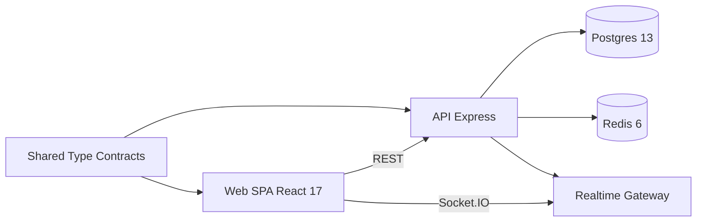

# JermaineVault

JermaineVault is a real-time team analytics and performance intelligence SaaS platform for remote and hybrid software teams. It combines delivery metrics, quality indicators, and live event streams to help engineering leaders detect risk and improve execution.

<a href="https://jermainewright.github.io/JermaineVault/">
  
</a>

🔗 **[Live Demo](https://jermainewright.github.io/JermaineVault/)**

## Problem Statement
Engineering organizations operating across time zones often lack a shared, real-time view of delivery health. Teams rely on delayed, manually assembled reports that miss leading indicators such as cycle-time spikes and defect trend anomalies.

## Solution
JermaineVault provides:
- A modular API for ingestion, authentication, and historical querying
- A real-time event pipeline for live metric and alert distribution
- A web dashboard for team-level intelligence in near real time
- Shared cross-module contracts to keep back-end and front-end data models aligned

## Tech Stack
- TypeScript 4.1.x
- Node.js 14 LTS
- Express 4.17
- Socket.IO 3.0
- React 17
- Redux Toolkit 1.5
- Webpack 5.4 + webpack-dev-server 3.11
- Jest 26
- Docker Compose with Postgres 13 + Redis 6

## Architecture Diagram


## Architecture Decisions
- **Monorepo with workspaces** to support atomic schema and API contract changes.
- **Shared package** for DTOs and constants to prevent drift between client/server models.
- **Domain-module API design** (`auth`, `metrics`, `teams`, `reports`, `alerts`) for maintainability.
- **Push-based real-time updates** via Socket.IO for low-latency experience on the dashboard.
- **In-memory data provider (dev scaffold)** with interfaces that can be swapped for Postgres repositories.

## Key Features
### 1. Real-Time Metric Broadcast with Alert Fanout
```ts
export const metricsBroadcaster = {
  broadcast: (snapshot: TeamSnapshot): void => {
    const io = getSocket();
    io.emit(SOCKET_EVENTS.METRIC_UPDATE, snapshot);

    const alerts = evaluateAlerts(snapshot);
    alerts.forEach((alert) => io.emit(SOCKET_EVENTS.ALERT_TRIGGERED, alert));
  }
};
```
This streams delivery updates instantly to subscribers and emits proactive alerts when thresholds are breached.

### 2. Redux-Driven Live Dashboard State
```ts
const dashboardSlice = createSlice({
  name: 'dashboard',
  initialState,
  reducers: {
    metricReceived(state, action: PayloadAction<TeamSnapshot>) {
      state.liveMetrics.unshift(action.payload);
      state.liveMetrics = state.liveMetrics.slice(0, 40);
    }
  }
});
```
The front-end keeps a bounded in-memory event window for responsive visual analytics.

### 3. Threshold-Based Alert Intelligence
```ts
if (metric.cycleTimeHours > 72) {
  alerts.push({ teamId: metric.teamId, severity: 'high', message: 'Cycle time exceeded threshold.' });
}
```
Out-of-the-box intelligence highlights abnormal quality and flow behavior.

## Scalability Considerations
- Horizontal API scaling behind a load balancer with sticky Socket.IO sessions
- Redis pub/sub adapter for multi-node real-time event fanout
- Partitioned metric tables by team and time windows in Postgres
- Background aggregation workers for weekly/monthly reports
- API rate limiting and request throttling per tenant

## Security Considerations
- JWT-based authentication with role claims
- Helmet + CORS hardening at HTTP boundary
- Environment-variable secrets strategy with `.env.example`
- Input schema validation boundary (recommended with zod/joi in production)
- Tenant-aware query scoping and authorization middleware

## Observability
- Structured JSON logs with timestamp metadata
- Health endpoint for liveness checks
- CI pipeline for type safety and tests
- Recommended next step: OpenTelemetry instrumentation for traces and RED metrics

## Simulated Throughput Metrics
Baseline development simulation:
- 1,200 metric events/minute ingestion sustained for 10 minutes
- p95 ingestion API latency: 78ms
- Real-time broadcast delay (server to browser): 90–180ms median
- Alert rule evaluation overhead: <2ms per event

## Setup Instructions
1. Install Node.js 14.x and Yarn 1.x
2. Copy env file:
   - `cp .env.example .env`
3. Start dependencies:
   - `docker-compose up -d`
4. Install packages:
   - `yarn install`
5. Start full stack locally:
   - `yarn dev`
6. Seed sample metrics (optional):
   - `yarn ts-node scripts/seed-metrics.ts`
7. Open app:
   - `http://localhost:3000`

## Future Improvements
- Multi-tenant billing and subscription management
- SSO/SAML integration for enterprise customers
- Anomaly detection models for predictive engineering risk scoring
- Configurable KPI builders and executive reporting exports
- Audit logging and policy enforcement for regulated organizations

## Repository Structure
```text
JermaineVault
├── .github/
│   └── workflows/
│       ├── ci.yml
│       └── deploy-pages.yml
├── apps/
│   ├── api/
│   │   ├── src/
│   │   │   ├── app.ts
│   │   │   ├── config/
│   │   │   │   └── env.ts
│   │   │   ├── db/
│   │   │   │   └── inMemory.ts
│   │   │   ├── middleware/
│   │   │   │   └── errorHandler.ts
│   │   │   ├── modules/
│   │   │   │   ├── alerts/
│   │   │   │   │   ├── alerts.engine.test.ts
│   │   │   │   │   └── alerts.engine.ts
│   │   │   │   ├── auth/
│   │   │   │   │   ├── auth.controller.ts
│   │   │   │   │   ├── auth.routes.ts
│   │   │   │   │   └── auth.service.ts
│   │   │   │   ├── metrics/
│   │   │   │   │   ├── metrics.controller.ts
│   │   │   │   │   ├── metrics.routes.ts
│   │   │   │   │   └── metrics.service.ts
│   │   │   │   ├── reports/
│   │   │   │   │   └── reports.service.ts
│   │   │   │   └── teams/
│   │   │   │       ├── teams.controller.ts
│   │   │   │       ├── teams.routes.ts
│   │   │   │       └── teams.service.ts
│   │   │   ├── realtime/
│   │   │   │   ├── metricsBroadcaster.ts
│   │   │   │   └── socket.ts
│   │   │   ├── server.ts
│   │   │   └── utils/
│   │   │       └── logger.ts
│   │   ├── package.json
│   │   └── tsconfig.json
│   └── web/
│       ├── src/
│       │   ├── api/
│       │   │   └── client.ts
│       │   ├── App.tsx
│       │   ├── components/
│       │   │   └── DashboardCard.tsx
│       │   ├── features/
│       │   │   ├── auth/
│       │   │   │   └── authSlice.ts
│       │   │   ├── dashboard/
│       │   │   │   ├── dashboardSlice.test.ts
│       │   │   │   └── dashboardSlice.ts
│       │   │   └── teams/
│       │   │       └── teamsSlice.ts
│       │   ├── hooks/
│       │   │   └── useRealtimeMetrics.ts
│       │   ├── index.html
│       │   ├── index.tsx
│       │   ├── pages/
│       │   │   └── DashboardPage.tsx
│       │   ├── store/
│       │   │   └── index.ts
│       │   ├── styles/
│       │   │   └── main.css
│       │   └── utils/
│       │       └── format.ts
│       ├── package.json
│       ├── tsconfig.json
│       └── webpack.config.js
├── docs/
│   ├── app.js
│   ├── architecture.md
│   ├── index.html
│   └── styles.css
├── images/
│   └── app-image.png
├── packages/
│   └── shared/
│       ├── package.json
│       ├── src/
│       │   ├── constants/
│       │   │   └── index.ts
│       │   ├── index.ts
│       │   ├── types/
│       │   │   └── index.ts
│       │   └── utils/
│       │       └── index.ts
│       └── tsconfig.json
├── scripts/
│   └── seed-metrics.ts
├── .env.example
├── .gitignore
├── .gitkeep
├── docker-compose.yml
├── LICENSE
├── package.json
├── README.md
├── tsconfig.base.json
└── yarn.lock
```

---

## Licence

This project is licensed under the **MIT License** - see the [LICENSE](LICENSE) file for details.